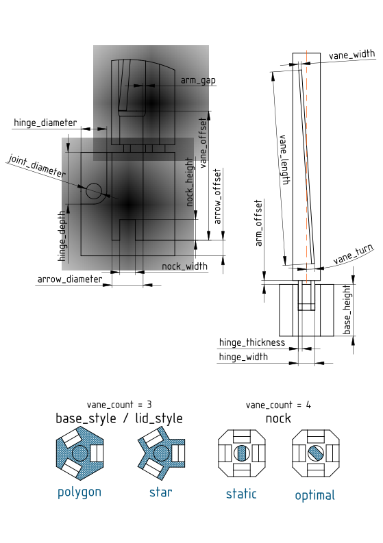
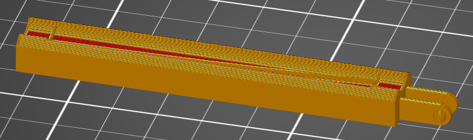
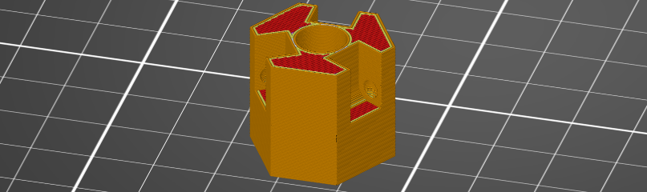

# OpenSCAD Fletching jig

## Overview
Simple yet effective fletching jig that will adjust to all your needs. Intended to provide new archers with access to 3D printer cheap way to fix broken arrows without a need for expensive off-the-shelf jig. Hopefully, even skilled shooters may find utility in this design.

### Features

+ highly adjustable to fit different arrows and vanes
+ supports both 3 and 4 vanes
+ straight, offset and **true** helical fletchings
+ features optional nock alignment
+ no additional tools required for assembly
+ hot swappable arms
+ very compact and light 

## Prerequisites

First you have to download latest version (2019.05 or newer) of [OpenSCAD](http://www.openscad.org/downloads.html). It's free and open source software available for all major desktop platforms. Nothing else is needed for editing and rendering. 

Additional software required will vary depending on your 3D printer.

## How to use

Although I provide several pre-rendered files as an example, it is very likely that you will not like something about them. If some of the parameters do not fit your setup or you simply want to enable some special features mentioned above, you will have to change the relevant parameters in the OpenSCAD customizer and render a new, unique jig yourself. Don't worry though, it is very simple!

1. Download and extract [latest release](https://github.com/moucha19/OpenSCAD-Fletching-jig/releases) of this project somewhere on your PC.
2. Locate [main.scad](./scad/main.scad) and open it in OpenSCAD. 
3. Go to the **Customizer** section:
   - **Windows/Linux**: Click on `Window` in the top menu and select `Customizer`.
   - **macOS**: Click on `View` in the top menu, then select `Customizer`.
4. The Customizer panel will appear on the right side of the OpenSCAD interface.
   - If you don't need to see or edit the code, you can close the editor window on the left to focus solely on the Customizer and 3D view.
5. Adjust the parameters:
   - You will see a list of customizable parameters, such as dimensions and features. See the table below for the detailed description or refer to [parameter reference drawing](./doc/parameter-reference.pdf).
   - Modify these parameters as needed to customize your model.
   - I did all i could to prevent user from inserting invalid values, but there could still be ways to generate completely invalid design - so be reasonable. I'd advise you to change parameters you're sure about first (arrow_diameter, vane_length etc.) and then adjust the rest.
6. **Preview your changes** in real-time. The 3D model will update automatically as you adjust the parameters.
7. Once you're satisfied with the customization, you can render the model (`F6`) and export it to your desired format with `File > Export > ...`.
   - By default, you will get file with every jig part. However, by changing `part_select` parameter, you can isolate individual parts in their correct orientation for 3D printing. This way you can split the jig into multiple files.

### Parameters

Parameter | Description | Tresholds
--- | --- | ---
base_style | choose the base shape | `"polygon"` or `"star"`
lid_style | choose the outer lid shape | `"polygon"` or `"star"`
joint_style | either snap-in ball joints or pin joints | `"ball"` or `"pin"`
arrow_diameter | slightly bigger than the arrow itself (may vary depending on your printer) | 2 < ■
arrow_offset | distance between the bottom of the base and arrow | 0 < ■ < `base_height`
base_height | height of the base | 5 < ■
hinge_width | width of the hinge cutout on the base | 2.1 < ■ < *depends on arrow_diameter*
hinge_thickness | thickness of the hinge extension attached to the bottom of the arm | 1 < ■ < *depends on hinge_width and joint_diameter*
hinge_diameter | diameter of the circular part of the hinge that revolves around a joint | 2 < ■ < `hinge_depth`
hinge_depth | how deep into the base is the hinge cutout | 5 < ■ < `base_height`
joint_diameter | diameter of the joint that connects two halves of the hinge together | 0 < ■ < *depends on joint_style*
arm_gap | gap for the vane foot, so that tension during clamping is distributed evenly and the vane fits in the closed jig | 0 < ■ < 1.5
arm_offset | distance between the top of the base and bottom of the arm | 0 < ■ < 1.5 
vane_count | number of vanes, typically 3 or 4 | 2 < ■ 
vane_style | changes shape of the vane | `"straight"` or `"helical"`
vane_length | length of the vane | 0 < ■
vane_width | width of the vane | 0 < ■ < *in the console*
vane_offset | how far from the end of the arrow will the vane be | *in the console* < ■
vane_turn | sets rotation of the fletching in degrees, negative values flip the direction | ■ < *in the console*
nock | choose whether to add a nock alignment guide and if so, how you want to rotate it | `"none"`, `"static"` or `"optimal"`
nock_width | width of the nock guide, smallest point of the arrow nock | 0 < `arrow_diameter`
nock_height | depth of nock in your arrow, this will be the height of the nock guide | 0 < `(base_height - arrow_offset)`
nock_diameter | if the nock alignment guide is enabled, this value takes precedence over `arrow_diameter` for the base hole when the nocked arrow is wider than bare shaft | 0 < ■



### Tresholds

Like I already mentioned, I've take some precautions to ensure a valid outputs.

First are constrained sliders in customizer. These are set to accommodate even extreme values and should be sufficient for everyone. They're nothing more than recommendations though and even values beyond their range may work just fine. If - for any reason - you'd want to allow values outside of default range, you can do so in `main.scad` by editing lines just like this one:

```openscad
//distance between the bottom of the base and arrow
arrow_offset = 3;//[0:0.1:100] 
```
where comment behind the assignment means *[min:precision:max]*. Go to [customizer documentation](https://customizer.makerbot.com/docs) for more information.

Second are tresholds in the module itself that are actually checking if desired parameters make sense or not. For example, if you have small jig for 6mm arrows, you can't have 10 centimeter wide hinge. So even if you're able to set something like this in the customizer, invalid parameters will be truncated in the module to a closest valid value. If this happens, you'll be informed about it in the console window with similiar line:

> hinge_thickness treshold (max = 5.25) reached!

List of some tresholds is in the table above. Some extreme values may still produce invalid results. That could either be because fixing it is more trouble than it's worth or because calculation of tresholds is impossible. Or it can simply be an oversight on my part. If you think something can be improved or you discover a bug, raise an issue or sumbit PR. 

Also, not all parameters are available in the customizer. Some of them do not change and should not have an effect on the validity of the generated output. However, if you did some testing and think some of these default values could be adjusted to generate better results, let me know.


## Printing recommendations

These settings were tested on Prusa MK2S. You might need to adjust them slightly.

Part | Layer height | Infill | Supports | Bed placement
--- | --- | --- | --- | --- 
Arm | 0.15mm or better | 15% | none / 3mm brim | 
Base | 0.2mm or better  | 15% | none | 
Lid | 0.35mm | solid | none | 

***

<a rel="license" href="http://creativecommons.org/licenses/by-nc-sa/4.0/"></a><br />This work is licensed under a <a rel="license" href="http://creativecommons.org/licenses/by-nc-sa/4.0/">Creative Commons Attribution-NonCommercial-ShareAlike 4.0 International License</a>.