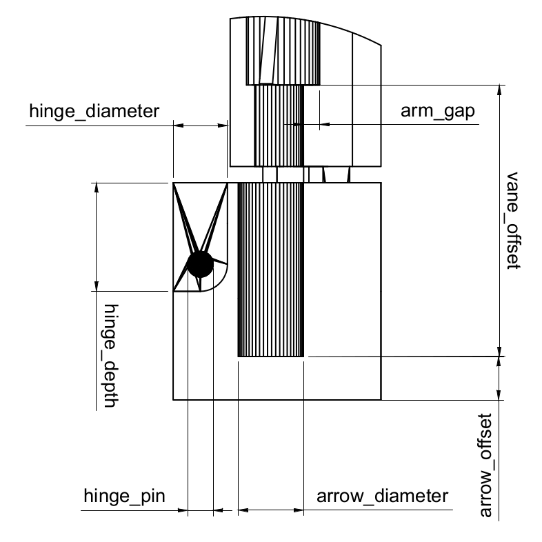
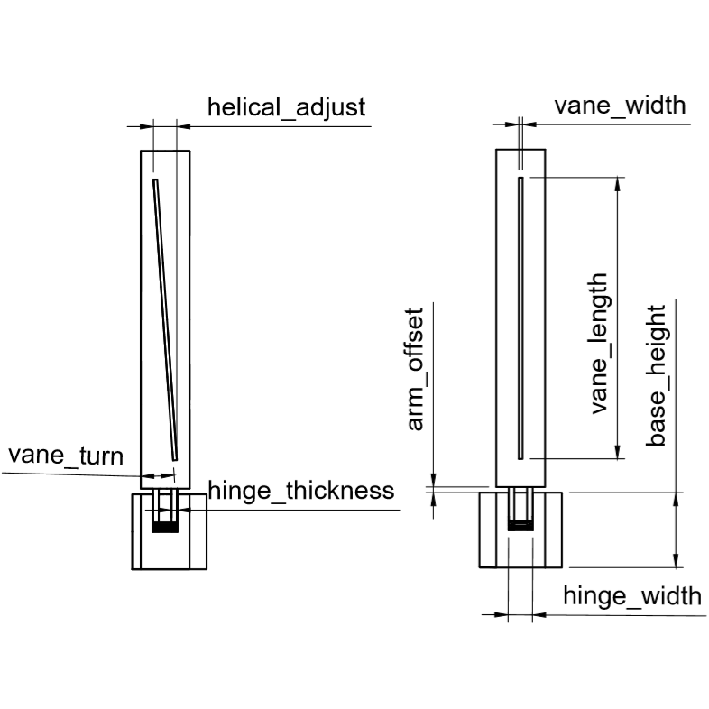
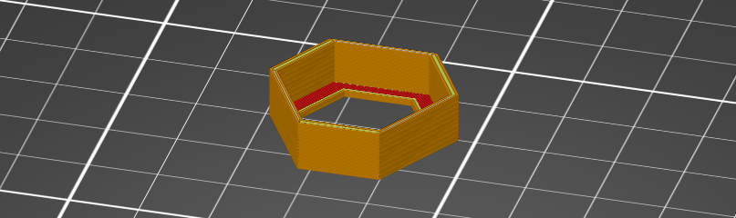

# OpenSCAD Fletching jig

## Overview
Simple yet effective fletching jig that will adjust to all your needs. Intended to provide new archers with access to 3D printer (such as myself) cheap way to fix broken arrows without a need for expensive off-the-shelf jig. Hopefully, even skilled shooters will find utility in this design.

### Features

+ highly adjustable to fit different arrows and vanes
+ straight, offset and **true** helical fletchings
+ no additional tools required for assembly
+ hot swappable arms
+ very compact and light 

## Prerequisites

First you have to download latest version (2019.05 or newer) of [OpenSCAD](http://www.openscad.org/downloads.html). It's free and open source software available for all major desktop platforms. Nothing else is needed for editing and rendering. 

Additional software required will vary depending on your 3D printer.

## How to use

Download and extract [latest release](https://github.com/TheWolftalon/OpenSCAD-Fletching-jig/releases) somewhere on your PC. Then open [main.scad](./scad/main.scad) file in OpenSCAD. You can close the editor on the left.

You should now see the preview with the customizer window on the right. There you can change parameters listed below. I did all i could to prevent user from inserting invalid values, but there could still be ways to generate completely invalid design - so be reasonable. I'd advise you to change parameters you're sure about first (arrow_diameter, vane_length etc.) and then adjust the rest.

Select which part you wish to render by changing part_select and then press *F6* when you're happy with the result. Then navigate to *File > Export > Export as STL* to save rendered mesh as a file.

### Parameters

Parameter | Description | Tresholds
--- | --- | ---
arrow_diameter | slightly bigger than the arrow itself (may vary depending on your printer) | 2 < *
arrow_offset | distance between the bottom of the base and arrow | 0 < * < base_height 
base_height | height of the base | 5 < *
hinge_width | width of the hinge cutout on the base | 2.1 < * < *depends on arrow_diameter*
hinge_thickness | thickness of the hinge extension attached to the bottom of the arm | 1 < * < *depends on hinge_width*
hinge_diameter | diameter of the circular part of the hinge that forms a joint | 2 < * < hinge_depth
hinge_depth | how deep into the base is the hinge cutout | 5 < * < base_height
hinge_pin | diameter of the sphere that connects two halves of the hinge together | 0 < * < min(hinge_diameter, space between hinge extensions)
arm_gap | gap for the vane foot, so that tension during clamping is distributed evenly | 0 < * < 1.5
arm_offset | distance between the top of the base and bottom of the arm | 0 < * < 1.5 
vane_length | length of the vane | 0 < *
vane_width | width of the vane | 0 < * < **!none!**
vane_offset | how far from the end of the arrow will the vane be | *in the console* < *
vane_turn | sets OFFSET fletching in degrees | * < *in the console*
helical | if true, HELICAL fletching will be used | 
helical_adjust | horizontal distance between the bottom and top corner of the HELICAL vane | 0 < *depends on arrow_diameter*
helical_direction | sign of the value determines left or right spin (+ left; - right) | 




### Tresholds

Like I already mentioned, I've take some precautions to ensure a valid outputs.

First are constrained sliders in customizer. These are set to accommodate even extreme values and should be sufficient for everyone. They're nothing more than recommendations though and even values beyond their range should work just fine. If - for any reason - you'd want to allow them, you can do so in main.scad by editing lines just like this one:
```openscad
//distance between the bottom of the base and arrow
arrow_offset = 3;//[0:0.1:100] 
```
where comment behind the assignment means *[min:precision:max]*. Go to [customizer documentation](https://customizer.makerbot.com/docs) for more information.

Second are tresholds in the module itself that are actually checking if desired parameters make sense or not. For example, if you have small jig for 6mm arrows, you can't have 10 centimeter wide hinge. So even if you're able to set something like this in the customizer, invalid parameters will be truncated in the module to a closest valid value. If this happens, you'll be informed about it in the console window with similiar line:
> <font color='red'>hinge_thickness treshold (max = 5.25) reached! </font>

List of these tresholds is in the table above. Note that extreme values in helical_adjust and vane_width can still produce invalid results. Fixing this is more trouble than it's worth so I'm not gonna do it :D. There might be more issues like that, so if you encounter anything weird, definitely report it.


## Printing recommendations

These settings were tested on Prusa MK2S. You might need to adjust them slightly.

Part | Layer height | Infill | Supports | Bed placement
--- | --- | --- | --- | --- 
Arm | 0.15mm or better | 15% | none / 3mm brim | 
Base | 0.2mm or better  | 15% | none | 
Lid | 0.35mm | solid | none | 

***

<a rel="license" href="http://creativecommons.org/licenses/by-nc-sa/4.0/"></a><br />This work is licensed under a <a rel="license" href="http://creativecommons.org/licenses/by-nc-sa/4.0/">Creative Commons Attribution-NonCommercial-ShareAlike 4.0 International License</a>.